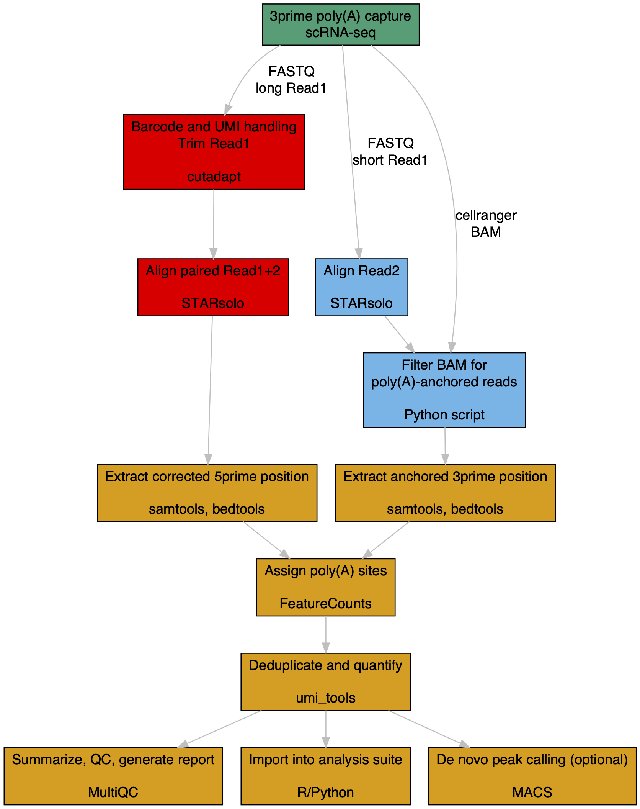

# scrapR


Supplementary R package for importing and processing [`scraps`](https://github.com/rnabioco/scraps) reference and output into R and Seurat. Python-equivalent support is under development.

### read reference (if converting to gene-level psi values)
```
saf <- scrapR::parse_saf_pf("polyadb32.hg38.saf.gz")
```

### read output
```
mat <- scrapR::scraps_to_matrix("R2_counts.tsv.gz", pf = saf)
```

### insert into Seurat object
```
so <- scrapR::scraps_to_seurat("R2_counts.tsv.gz", pf = saf, so)
```

### differential usage testing
```
res <- PA_DEXSeq(mat, cell_ids1, cell_ids2)
```

### report diff RBP motifs from [oRNAment](http://rnabiology.ircm.qc.ca/oRNAment) annotations
```
motifs_prep (rna, id1, id2) # by default creates a file hs_motifs_05_oRNAament_rbp.csv.gz
mdb <- read_csv("hs_motifs_05_oRNAament_rbp.csv.gz")
DE_PA_motifs(mdb, res)
```
